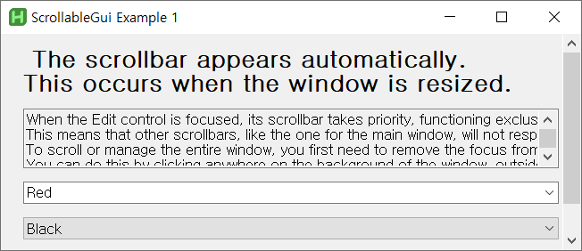

# scrollable-gui
This class provides scrollable [GUI](https://www.autohotkey.com/docs/v2/lib/Gui.htm) functionality for AutoHotkey v1 and v2 with dynamic size updates.  
It supports horizontal and vertical scrolling, and allows for customization of scroll behavior, including focus-based inner scrolling.  
A detailed user guide will be provided at a later date.  
For version-specific examples and integration code, refer to the `main-ahkv1` and `main-ahkv2` branches of this repository.

> Documentation is currently delayed due to various circumstances.  
> In the meantime, if you are interested in this AutoHotkey script or project, we recommend the following AutoHotkey Forum topics:

- [How to show the scrollbar on a Gui Window?](https://www.autohotkey.com/boards/viewtopic.php?f=82&t=131307)
- [Scroll window not showing all the controls](https://www.autohotkey.com/boards/viewtopic.php?f=82&t=134315)
