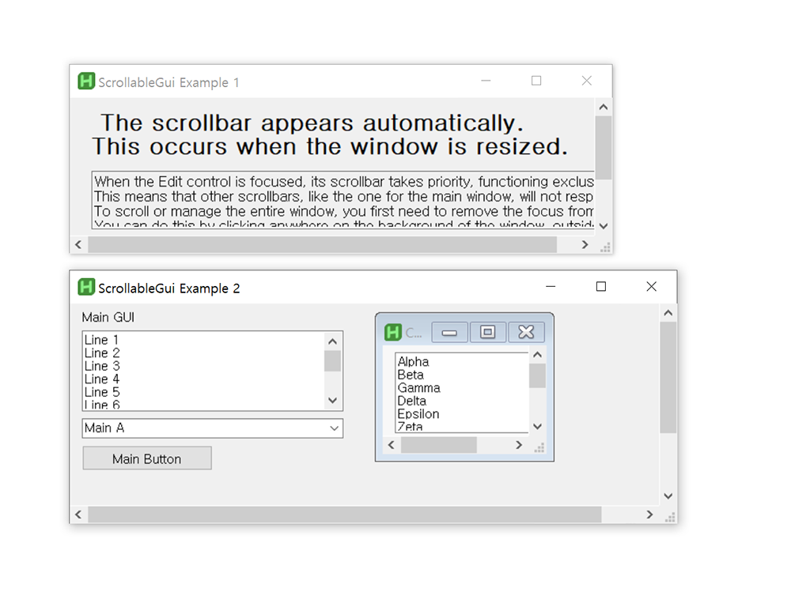

# ScrollableGui
This class provides scrollable [Gui](https://www.autohotkey.com/docs/v2/lib/Gui.htm) functionality for AutoHotkey **v1 and v2**, with dynamic **scroll range** updates.  
It supports horizontal and vertical scrolling, mouse wheel scrolling, and resize-aware behavior.  
It also provides optional **focus-aware wheel routing** for common controls ([Edit](https://www.autohotkey.com/docs/v2/lib/Edit.htm)/[UpDown](https://www.autohotkey.com/docs/v2/lib/GuiControls.htm#UpDown), [ComboBox](https://www.autohotkey.com/docs/v2/lib/GuiControls.htm#ComboBox), etc.).

For version-specific integration code, see the `main-ahkv1` and `main-ahkv2` branches of this repository.  
For runnable examples, see the `examples/` folder.

---

## Features
- Vertical + horizontal scrollbars
- Mouse wheel scrolling  
  - `Shift + Wheel` → horizontal scroll (common Windows UX)
  - Optional focus-aware wheel routing for common controls
- Resize-aware updates  
  - Recalculates scroll ranges/pages during sizing
  - Scrolls window contents to match the new scroll positions
- Helpers
  - Calculate the bounding rectangle of child controls
  - Explicitly expand the stored boundary to include child controls
  - Update the stored content boundary and optionally apply GUI MaxSize

---

## Requirements
- AutoHotkey **v2.0.0+** (for the v2 branch)  
- AutoHotkey **v1.1.35+** (for the v1 branch)

---

## Installation
1. Copy `ScrollableGui.ahk` into your project (or add this repository as a submodule).
2. `#Include` it.
3. Call `ScrollableGui.init()` once (global message hooks).
4. Register a GUI window with `ScrollableGui.register()`.

---

## Public API (shared concept; see each branch for exact signatures)

### `ScrollableGui.init()`
Registers internal message handlers (`WM_VSCROLL`, `WM_HSCROLL`, `WM_MOUSEWHEEL`, `WM_MOUSEHWHEEL`, `WM_SIZING`, etc.).  
Call once per script.

### `ScrollableGui.register(hWndOrGui, innerScrollOnFocus := true) -> true/false`
Registers a window as scrollable.
- `innerScrollOnFocus` (default `true`): when focus is inside a child control, wheel input may be routed to that control when appropriate.

The initial content boundary is the window's current client size. Controls outside that boundary are not included automatically.

### `ScrollableGui.unregister(hWndOrGui) -> true/false`
Stops managing the window.  
If `ScrollableGui.init()` is active (it hooks `WM_DESTROY`), the window is automatically unregistered when it is destroyed—so an explicit call is usually unnecessary.

### `ScrollableGui.isRegistered(hWndOrGui) -> true/false`
Returns whether the window is registered.

### `ScrollableGui.enableInnerScrollOnFocus(hWndOrGui, onOff := true)`
Toggles focus-based wheel routing after registration.

### `ScrollableGui.syncSize(hWndOrGui) -> true/false`
Forces recalculation of scroll ranges/pages using current window size and stored boundary.

### `ScrollableGui.calculateInnerControlsSize(hWndOrGui, &left?, &top?, &right?, &bottom?, visibleControlsOnly := 1) -> true/false`
Computes the bounding rectangle of child controls. `visibleControlsOnly` accepts the following modes:
- `0`: include all controls.
- `1`: include controls reported as visible by `ControlGetVisible()` (existing/default behavior).
- `2`: include controls with their own `WS_VISIBLE` style, even while the parent GUI is hidden.

### `ScrollableGui.expandBoundaryToControls(hWndOrGui, visibleControlsOnly := 2, setMaxSize := true) -> true/false`
Expands, but never shrinks, the stored content boundary to include child controls and the GUI margins.
Call this explicitly when controls outside the current client area are intended to be scrollable content.

### `ScrollableGui.getBoundary(hWndOrGui, &width?, &height?) -> true/false`
Returns the stored content boundary size.

### `ScrollableGui.updateBoundary(hWndOrGui, newWidth?, newHeight?, setMaxSize := true) -> true/false`
Updates stored boundary (content size), then calls `syncSize()`.  
Optionally applies MaxSize to clamp resizing.

---

## Background / Related Threads

This project started as a response to a forum question/request:

- [How to show the scrollbar on a Gui Window?](https://www.autohotkey.com/boards/viewtopic.php?t=131307)

Project threads:

- v2: https://www.autohotkey.com/boards/viewtopic.php?t=139976
- v1: https://www.autohotkey.com/boards/viewtopic.php?t=139977

---

## Credits
Special thanks to [@Lexikos](https://github.com/Lexikos). Without the original forum post  
[Scrollable GUI - Proof of Concept](https://www.autohotkey.com/board/topic/26033-scrollable-gui-proof-of-concept/#entry168174),  
this project would not have been possible to begin in the first place.

---

## License
MIT License
